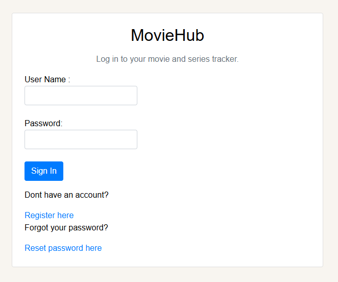
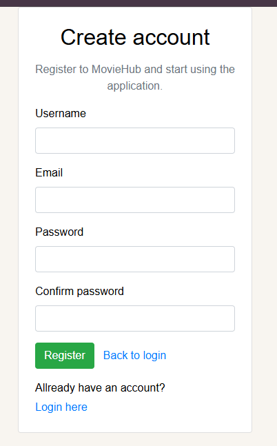
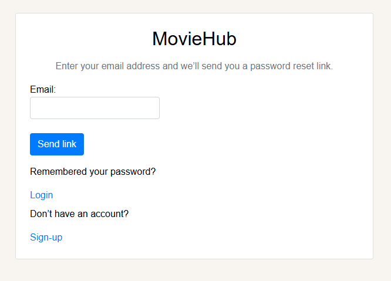
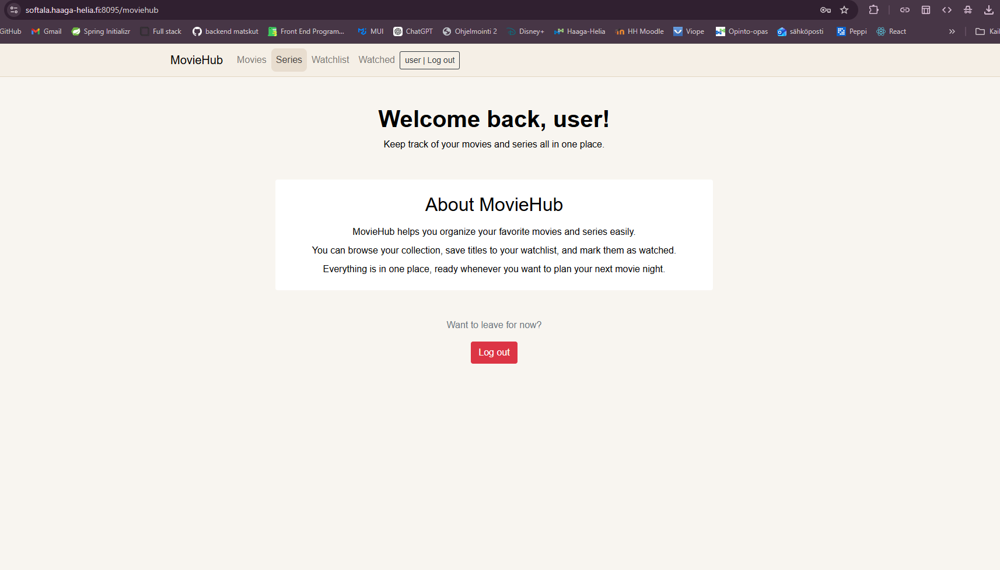
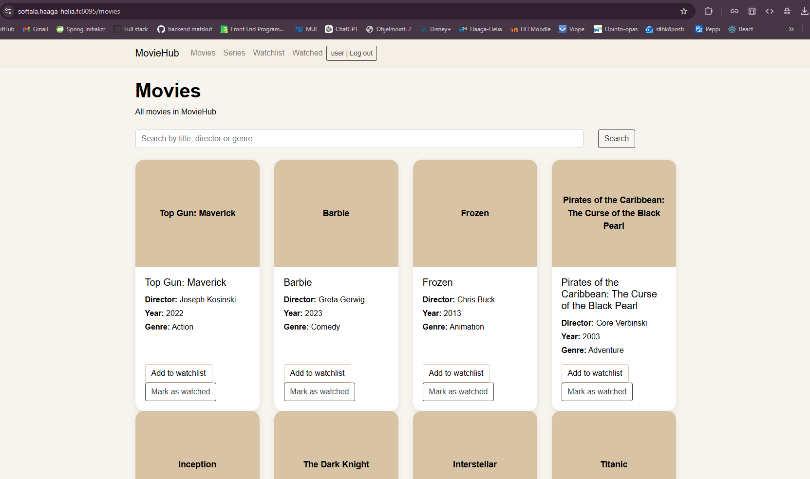
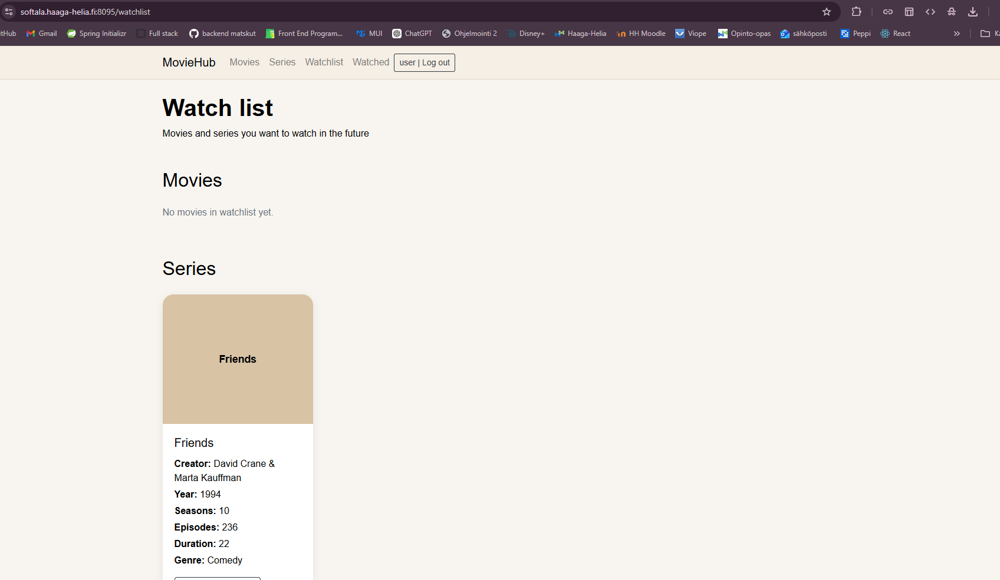
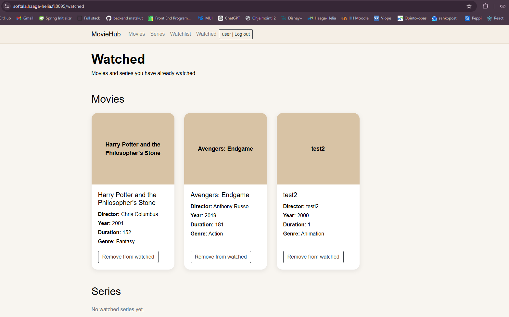

# MovieHub

MovieHub on backend-kurssilla toteutettu harjoitusprojekti, jonka tarkoituksena oli harjoitella Spring Boot -sovelluksen rakentamista. Toteutin web-sovelluksen, jolla käyttäjä voi selata elokuvia ja sarjoja, hakea sisältöä, lisätä niitä watchlistille sekä merkitä niitä katsotuiksi.

Sovelluksessa on myös käyttäjien rekisteröityminen, kirjautuminen ja salasanan palautus sähköpostin kautta. Lisäksi projektissa on toteutettu REST API sekä admin-käyttäjälle omat oikeudet elokuvien ja sarjojen lisäämiseen ja poistamiseen.

Moviehub löytyy osoitteesta --> https://softala.haaga-helia.fi:8095/login

## Projektin tavoite

Projektin tavoitteena oli harjoitella backend-kehityksen keskeisiä asioita käytännössä. Työssä hyödynnettiin Spring Bootia, Spring Data JPA:ta, Spring Securityä, Thymeleafia sekä PostgreSQL-tietokantaa. Tarkoituksena oli yhdistää samaan projektiin tietokanta, käyttöliittymä, tietoturva, validointi ja rajapintojen toteutus.

## Sovelluksen toiminnot

MovieHubissa käyttäjä voi:

- selata elokuvia ja sarjoja
- hakea sisältöä nimen, ohjaajan, tekijän tai genren perusteella
- lisätä elokuvia ja sarjoja watchlistille
- merkitä sisältöä katsotuksi
- poistaa sisältöä watchlistiltä tai watched-listalta
- rekisteröidä uuden käyttäjätilin
- kirjautua sisään
- palauttaa salasanan sähköpostiin lähetettävän linkin avulla

Admin-käyttäjä voi lisäksi:

- lisätä uusia elokuvia
- lisätä uusia sarjoja
- poistaa elokuvia
- poistaa sarjoja

## Sovelluksen rakenne

Sovelluksessa on omat sivut elokuville, sarjoille, watchlistille ja katsotuille sisällöille. Käyttäjä voi siirtää elokuvia ja sarjoja eri näkymien välillä sen mukaan, haluaako hän katsoa ne myöhemmin vai onko ne jo katsottu.

Moviehubissa on myös hakutoiminto, jonka avulla käyttäjä voi etsiä elokuvia ja sarjoja eri tiedoilla. Lisäksi sovelluksessa on genreihin perustuvaa suodatusta.

## Käytetyt teknologiat

Projektissa käytin seuraavia teknologioita:

- Java
- Spring Boot
- Spring Data JPA
- Spring Security
- Thymeleaf
- Bootstrap
- PostgreSQL (Tietokanta Neon DB sivulla)
- JavaMailSender
- Projektin HTML-sivujen ulkoasu generoitu tekoälyllä (ChatGPT)

## Tietoturva ja käyttäjähallinta

Sovelluksessa on toteutettu kirjautuminen ja roolipohjainen käyttöoikeuksien hallinta Spring Securityn avulla. Tavallinen käyttäjä voi käyttää sovelluksen perustoimintoja, kun taas admin-käyttäjällä on oikeus hallita sisältöä.

Salasanoja ei tallenneta tietokantaan sellaisenaan, vaan ne tallennetaan salattuina. Salasanan palautus toimii sähköpostin kautta lähetettävän reset linkin avulla.

## REST API

Projektissa toteutin myös REST-rajapinnan elokuville, sarjoille ja genreille. Rajapinnan avulla tietoja voidaan hakea ja hallita ohjelmallisesti. REST API on suojattu niin, että vain admin-käyttäjällä on siihen oikeus.

## Application views

### Login page
Users can sign in to MovieHub, navigate to registration, or open the password reset page.

### Registration page
New users can create an account by entering a username, email address, and password.

### Password reset page
Users can request a password reset link by entering their email address.

### Home page
After logging in, users are welcomed to MovieHub and can navigate to movies, series, watchlist, and watched sections.

### Movies page
The movies page displays all movies in the application. Users can search by title, director, or genre, add movies to the watchlist, and mark them as watched.

### Watchlist page
The watchlist page shows movies and series that the user wants to watch later.

### Watched page
The watched page contains movies and series that the user has already watched.

